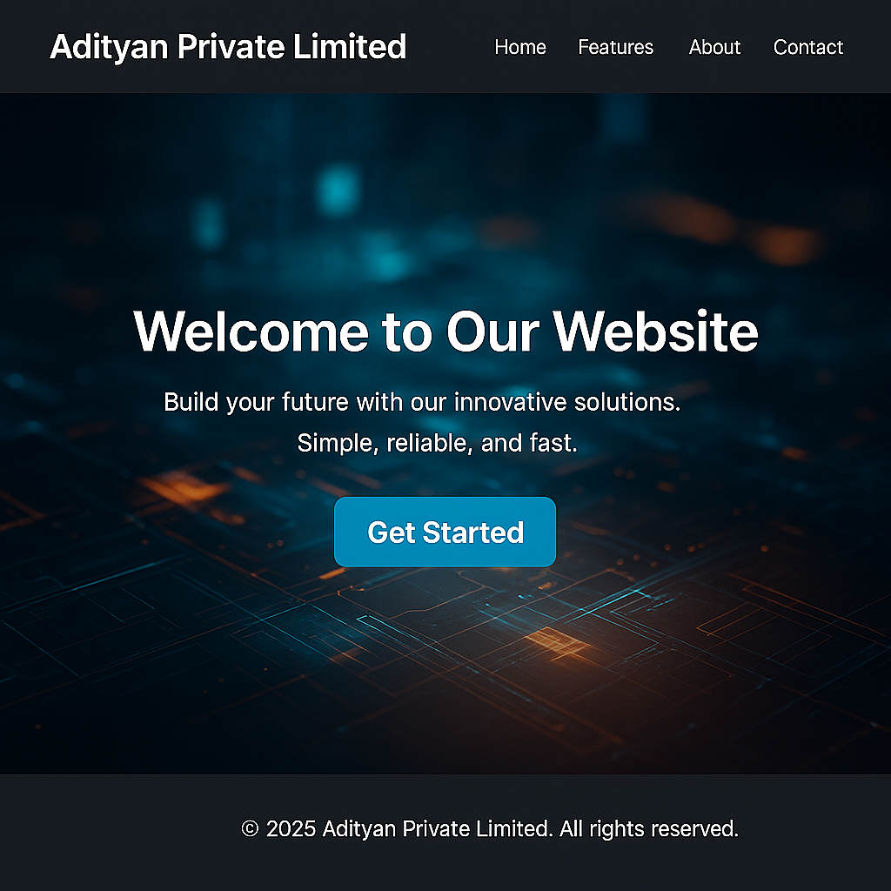

### 📄 `README.md`

```markdown
# Adityan Private Limited - Responsive Landing Page

A simple and modern responsive landing page created using HTML and CSS. This project is perfect for learning the basics of web structure, layout design, and responsive styling.

## 🌐 Live Demo

> You can run this locally using the **Live Server** extension in Visual Studio Code.

---

## 📌 Features

- Responsive header with navigation
- Visually appealing hero section with background image
- Clear call-to-action (CTA) button
- Minimalistic and clean design
- Mobile-friendly layout
- Footer with copyright

---

## 🛠️ Tools Used

- **Visual Studio Code** (Editor)
- **HTML5**
- **CSS3**
- **Live Server** extension
- **Chrome** or any modern browser

---

## 📁 Folder Structure

```

landing-page/
├── index.html
├── style.css
└── README.md

```

---

## 🚀 How to Run

1. Clone or download this repository.
2. Open the folder in **VS Code**.
3. Make sure you have installed the **Live Server** extension.
4. Right-click on `index.html` and select **"Open with Live Server"**.
5. The page will open in your browser at `http://127.0.0.1:5500/` (or a similar local address).

---

## 🧠 Concepts Covered

- Flexbox layout system
- CSS media queries for responsiveness
- Linking external stylesheets
- Hero section with background image
- Semantic HTML structure

---

## 📸 Preview

 <!-- Replace with actual image if hosting on GitHub -->

---

## 📃 License

This project is open-source and available under the [MIT License](LICENSE).

---

## 🙌 Acknowledgements

- Background image from [Unsplash](https://unsplash.com)
- Fonts and styling inspired by clean UI principles

---

## 🧑‍💻 Developed By

**Adityan P**  
B.Tech CSD Student | Passionate Web Developer  
```
